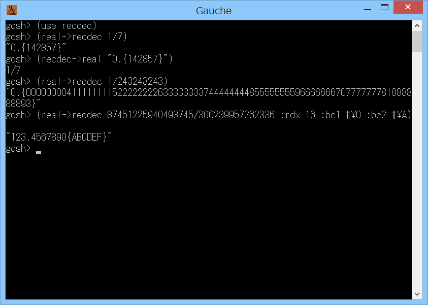

# recdec



## 概要
- Gauche で、有理数と循環小数の相互変換を行うためのモジュールです。


## インストール方法
- recdec.scm を Gauche でロード可能なフォルダにコピーします。  
  (例えば (gauche-site-library-directory) で表示されるフォルダ等)


## 使い方
- 以下を実行します。
  ```
    (use recdec)
  ```
  以後、(real->recdec 1/7) のようにして、有理数を循環小数の文字列に変換できます。  
  また、逆に、(recdec->real "0.{142857}") のようにして、  
  循環小数の文字列を有理数に変換できます。

- 使用可能な手続きを以下に示します。
  - `(real->recdec num)`  
    有理数 num を循環小数の文字列に変換します。  
    num が不正確数であった場合には、正確数に変換してから処理します。  
    循環小数の循環部分は、{ } で囲われます。  
    ( 例. 679/5500 ==> 0.123454545 ... ==> "0.123{45}" )

  - `(recdec->real num-st)`  
    循環小数の文字列を有理数に変換します。  
    循環小数の循環部分は、{ } で囲われている必要があります。  
    ( 例. "0.123{45}" ==> 0.123454545 ... ==> 679/5500 )


## その他 注意事項等
1. 小数部の桁数が多い場合に、時間がかかるケースがあります。  
   (例えば (real->recdec 9/9999999991)  
   ;; ==> "0.{00000000090000000081 ～ 以下省略" (131102626文字の文字列)  
   を実行すると、Core i3 の PC で 10 分程度かかります)

2. 循環部分の検出には、フロイドの循環検出法を使用しています。  
   この方法は、余りの保存テーブルが不要になるため、省メモリですが、  
   計算には多少時間がかかります。


## 参考情報
1. 特徴的なパターンの循環節を持つ循環小数  
   https://www.asahi-net.or.jp/~kc2h-msm/mathland/math05/math0506.htm


## 環境等
- OS
  - Windows 8.1 (64bit)
- 言語
  - Gauche v0.9.8

## 履歴
- 2019-10-28 v1.00 (初版)
- 2019-10-28 v1.01 変数名見直し


(2019-10-28)
